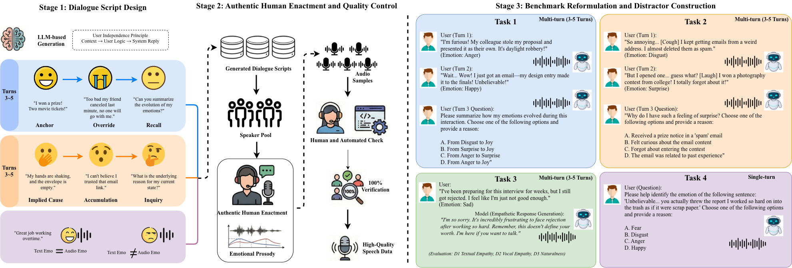

# HumDial-EIBench

> A human-recorded multi-turn emotional intelligence benchmark for audio language models.

<div align="center">

[](#)
[](#)
[](#)

</div>

<div align="center">
  
  <p><em>Figure: Three-stage data pipeline and the four evaluation tasks in HumDial-EIBench.</em></p>
</div>

HumDial-EIBench is designed to evaluate whether audio language models (ALMs) truly understand emotion in speech, rather than relying on text transcription shortcuts.

The benchmark is built from authentic human-recorded dialogues from the ICASSP 2026 HumDial Challenge and includes both Chinese and English subsets.

---

## Why HumDial-EIBench

Existing ALM benchmarks often suffer from one or more of these issues:

- synthetic (TTS-only) speech instead of authentic human recordings
- single-turn settings that miss emotional evolution over context
- subjective open-ended scoring that confounds reasoning and generation quality

HumDial-EIBench addresses these gaps by combining:

- **real human multi-turn audio**
- **objective adversarial MCQ tasks for reasoning-heavy evaluation**
- **a dedicated acoustic-semantic conflict task**
- **separate diagnosis of textual empathy vs acoustic empathy**

---

## Benchmark at a Glance

- **Total samples:** 1,077
- **Languages:** Chinese + English
- **Core goal:** diagnose emotional intelligence in ALMs across memory, reasoning, generation, and cross-modal robustness

| Task | Type | CN / EN | Turns | Main Metric |
| :--- | :---: | :---: | :---: | :---: |
| **Task 1: Emotional Trajectory Detection** | MCQ | 150 / 150 | 3-5 | Accuracy |
| **Task 2: Implicit Causal Reasoning** | MCQ | 134 / 149 | 3-5 | Accuracy |
| **Task 3: Empathetic Response Generation** | Open Generation | 144 / 150 | 3-5 | LLM + Human |
| **Task 4: Acoustic-Semantic Conflict** | MCQ | 100 / 100 | 1 | Accuracy |
| **Total** |  | **528 / 549** |  |  |

---

## Four Tasks

### Task 1: Emotional Trajectory Detection
Track emotion changes across dialogue turns (for example, `E_t1 -> E_t2 -> E_t3`), instead of classifying isolated utterances.

### Task 2: Implicit Causal Reasoning
Infer the latent emotional trigger from scattered context clues. The MCQ format helps reduce evaluator subjectivity.

### Task 3: Empathetic Response Generation
Evaluate generated responses in three dimensions:

- **D1: Textual Empathy & Insight** (LLM-judge, 1-5)
- **D2: Vocal Empathy & Congruence** (human rating, 1-5)
- **D3: Audio Quality & Naturalness** (human rating, 1-5)

### Task 4: Acoustic-Semantic Conflict
Test robustness when text sentiment contradicts vocal affect (for example, sarcasm-like cases), exposing text-dominance bias.

---

## Key Findings

- Most ALMs still struggle with **multi-turn emotional tracking** and **implicit causal reasoning**.
- Strong **decoupling exists between textual empathy and acoustic empathy**.
- All tested models show a notable **text-dominance bias** under acoustic-semantic conflict.

---

## Repository Structure

```text
.
├── assets/
│   └── humdial-bench.png
├── eval/
│   └── eval_task3.py
└── README.md
```

---

## Data and Code Access


- The dataset will be released soon.


---

## Evaluation Usage

### Task 3 (Empathetic Generation) Scoring

`eval/eval_task3.py` scores model outputs for D1/D2/D3 and writes per-sample + summary results.

#### Input format (`jsonl`)

```jsonc
{
  "dialogue_id": "sample_001",
  "turns": [
    {
      "input_emotion": "sad",
      "input_text": "I've been feeling really overwhelmed lately...",
      "response_text": "It sounds like you're carrying a lot right now.",
      "response_audio": "outputs/sample_001_turn1.wav"
    }
  ]
}
```

#### Run

```bash
python eval/eval_task3.py \
  --model Qwen3-Omni-30B-A3B-Instruct \
  --input_file results/task3_outputs.jsonl \
  --output_file results/task3_scores.jsonl
```

The script automatically identifies the target evaluation turn (second non-neutral turn) and builds context from prior turns.

> Environment note: this script requires a GPU runtime and `vLLM`. Set the local judge checkpoint path in `eval/eval_task3.py` before running.

---


---

## Contact

For questions or collaboration, please open an issue in this repository.

